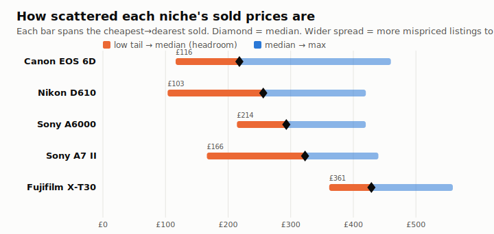
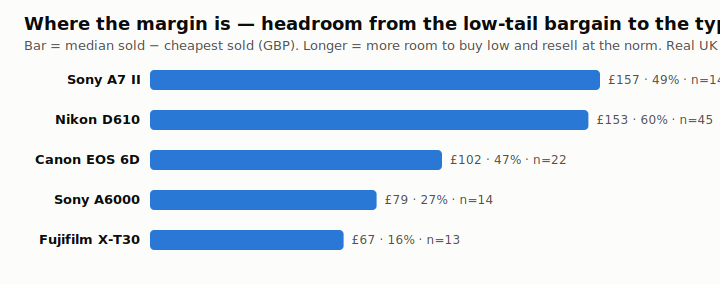

# valbot — the eBay bargain finder 🔎📷

**valbot watches eBay for used cameras that are selling for less than they're worth, and sends you a WhatsApp when it finds one.** It never bids or spends money — it just points and says *"this one looks underpriced, here's the most I'd pay."* You decide.

Think of it as a friend who has memorised what every used camera actually sells for, sits on eBay 24/7, and taps you on the shoulder the moment a good one is going cheap.

---

## The idea in one picture

Some cameras sell for wildly different prices depending on how the listing is written, when it ends, and whether the seller knows what they have. That scatter is the opportunity: buy near the bottom of the range, and the camera is still worth the middle of the range.



Every bar above is one camera model, drawn from the **cheapest** to the **dearest** it actually sold for on eBay UK. The orange part is the gap between the cheapest sales and the typical (median) sale — that gap is the room to make money. A Nikon D610 that usually sells for ~£256 has sold for as little as £103. Catch one of those and you're up ~£150 before you've done anything.



The bot hunts in the niches with the **biggest, most reliable** gaps.

---

## How it works, plainly

Every hour, for each camera model it watches, the bot:

1. **Looks at auctions ending in the next 24 hours** (via eBay's official free data feed).
2. **Compares each one** against what that exact model *actually sold for recently* (real completed-sale prices).
3. **Works out the most it would pay** — deliberately conservative, after all eBay fees and postage both ways.
4. **Messages you on WhatsApp** if an auction's current price is below that number, with the max bid and the item link.

```
watch auctions ending soon → compare to real sold prices → work out a safe max bid → WhatsApp you the bargains
```

It only messages you about auctions that **also have a "Buy It Now"** — so there's always a known price you can grab immediately if it's cheap enough.

---

## Why it's cautious (and how it "knows what a camera is worth")

The bot never trusts a single price. For each model it builds a **picture of the whole market** and bids against the *low, safe end* of it — not the average. That way, when it's unsure, it simply offers less.

| What it measures | Why it matters |
|---|---|
| **How many sales it found** (`n`) | More past sales = more reliable. It ignores models with too few. |
| **How spread out the prices are** | If a model's prices are all over the place, it's harder to value — so it bids lower or stays quiet. |
| **A confidence score (0–1)** | Combines the two above. High = lots of tight, agreeing sales. |
| **Conservative value** | The number every decision uses. It's the *typical* price minus a safety margin for uncertainty — never the middle. |

So a well-understood model with lots of consistent sales gets a near-full bid; a thin or chaotic one gets a low bid or no alert at all. **Uncertainty is built into the price, not bolted on as a warning.**

### How we assess *data* quality

Sold-price data from eBay is messy, so the bot cleans and checks it before trusting a number:

- **It filters out the junk.** Brand-new/boxed items, "for parts/not working" units, and multi-item bundles (a camera *with lenses*) are removed — otherwise they'd fake the price up or down. Example: one niche's raw average was £696 because of lens bundles; cleaned, it's a realistic £429.
- **It matches the exact model.** A "Sony A6000 body" search that drags in lenses or the wrong model is discarded — it only compares like with like.
- **It measures scatter, not just averages.** The spread of sold prices *is* the signal for where the bargains are.
- **It checks itself against reality.** Every alert is logged with its prediction. When a real flip resolves, you note what it actually resold for, and `calibrate.py` reports whether the bot was right and what to nudge. Nothing is trusted blind.

---

## Two data sources — and why it's basically free to run

| Feed | What it's for | Cost |
|---|---|---|
| **Sold prices** (RapidAPI) | Knowing what each model is worth | Metered: **50 lookups/month**. Prices barely change week to week, so results are **cached for 30 days** → about **1 lookup per model per month**. |
| **Live auctions** (eBay Browse API) | Finding what's for sale right now | **Free**, official eBay. No meaningful limit. |

Because the "what's it worth" numbers are cached, the bot can check live auctions **every hour** and still spend only a handful of the 50 monthly lookups. Running it live is essentially free.

---

## What an alert looks like

> 🏷️ **Underpriced listing**
> Sony A7 II
>
> Current bid: **£132.08**
> **MAX BID: £179.53** (headroom £47.45)
> Exp. profit: **£122.83** · margin 41%
> Buy It Now: £210.00
>
> Confidence: high (0.76) · n=14 sold comps
> _Read-only alert. You place the bid._

You get the most you should pay, the expected profit after all fees, how confident the bot is, and a link. You always place the bid yourself.

---

## See the data yourself

- **`python scan.py --sector cameras-lenses`** ranks every niche by how much bargain-room it has (the charts above are generated from this).
- **`python report.py`** builds a self-contained **HTML dashboard** (`reports/scatter-dashboard.html`) you can open in any browser.
- Figures for this README regenerate with **`python docs/make_figures.py`**.

---

## Run it yourself

```bash
pip install -r requirements.txt

# No keys needed — runs the whole thing on built-in sample data and prints, doesn't send:
python run.py --mode mock

# The live camera route (needs the keys below): free auctions + cached sold prices
python run.py --mode hybrid --sector cameras-lenses

# Rank the niches by bargain-room (real sold data, cached):
python scan.py --sector cameras-lenses --mode thirdparty
```

Run the tests (86 of them) with `python -m pytest -q`.

### The keys you need (one-time)

It runs on GitHub Actions on a schedule, so the keys live as **repository secrets** (Settings → Secrets and variables → Actions), never in the code:

| Secret | What it's for | How to get it |
|---|---|---|
| `RAPIDAPI_KEY` | Sold prices | Subscribe to "eBay Average Selling Price" on rapidapi.com |
| `EBAY_APP_ID` / `EBAY_CERT_ID` | Live auctions | Free eBay developer account at developer.ebay.com |
| `CALLMEBOT_PHONE` / `CALLMEBOT_APIKEY` | WhatsApp alerts | WhatsApp `+34 644 51 95 23` the text `I allow callmebot to send me messages` |

The bot runs **hourly** (`.github/workflows/live-cameras.yml`) and only messages you on a real opportunity. Alerts safely print to the log until CallMeBot is set up, so nothing breaks if you add the keys later. **Kill switch:** disable the workflow in the Actions tab — nothing runs, no money ever moves without you.

---

## The two lanes

valbot started life valuing **graded sports cards** and the same engine now runs **cameras & lenses** (the live lane). Pick one with `--sector`; everything else is shared. Category-specific settings (fees, search terms, price caps) live in [`config.yaml`](config.yaml).

## What's under the hood

```
config.yaml            every tunable — search terms, fees, thresholds, budget
run.py                 the hourly live run (find → value → alert)
scan.py                niche scatter scanner
report.py              HTML dashboard from the collected data
src/valbot/
  valuation.py         builds the price distribution + conservative value
  fees.py              itemised all-in eBay fee model + max-bid solver
  camera.py            turns a messy listing title into an exact model
  ebay_client.py       data sources: mock / RapidAPI / eBay Browse / hybrid
  cache.py             30-day sold-price cache + monthly budget guard
  alert.py             CallMeBot WhatsApp
  scan.py              scatter ranking
  calibrate.py         checks predictions against real outcomes
data/
  cache/               cached sold prices + the monthly lookup ledger
  scatter_history.json every scan, over time
  outcomes.json        logged predictions — fill in real results to calibrate
.github/workflows/
  live-cameras.yml     the hourly live camera watcher
  scan.yml             manual scatter scan
```

---

*Read-only by design. valbot finds and explains; you decide and buy. Decisions and rationale are recorded in [CONTEXT.md](CONTEXT.md) and [docs/adr/](docs/adr).*
